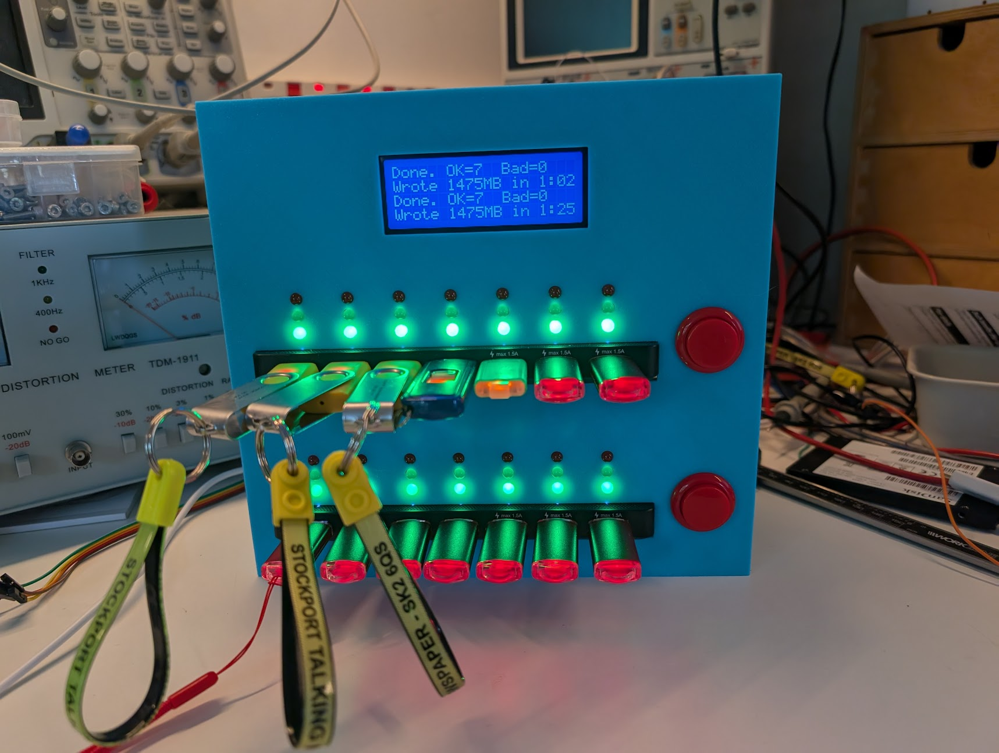
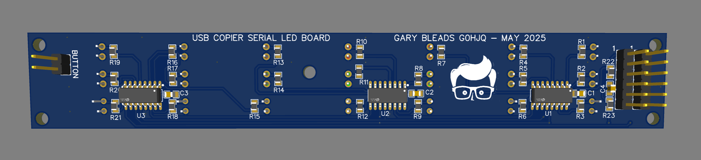
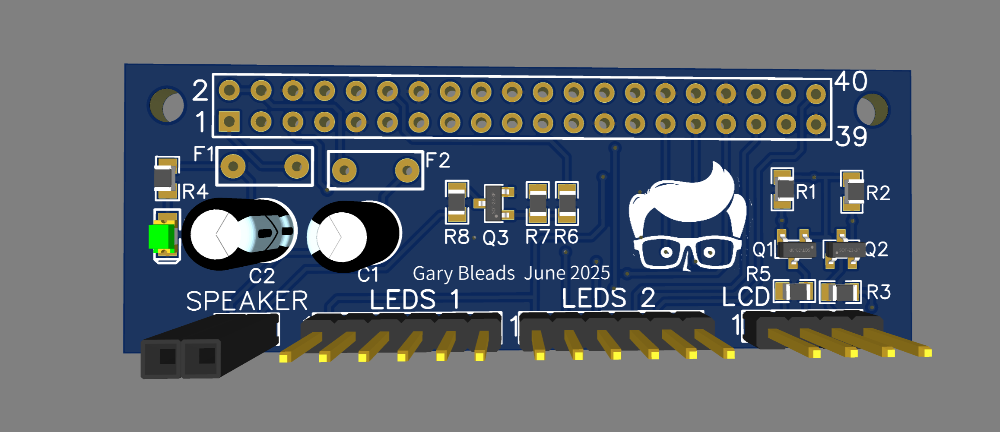

# pi_copier
A Raspberry Pi based USB flash drive copier for talking newspapers and the like.

## Introduction

## Hardware
You will need the following:
* A Raspberry Pi 5 with at least 4GB of Ram. A Raspberry Pi 4 should also work, but I don't recommend using a Pi 3 or older as they only have USB 2 ports which may not be fast enough.
* 5 volt power supply capable of supplying 27 Watts or more
* Raspberry Pi cooler. Actually this is optional as the processor isn't very heavily utilised and doesn't get very hot.
* Micro SD card, 8GB or more.
* Two USB hubs. I used a pair of TP-Link UH700 7-Port USB 3 hubs. These come with an external 12v power supply but seem to work OK without for us, drawing their power from the Raspberry Pi's USB ports. If you are copying to high-speed flash drives, you may need to supply this extra power.
* 20-character x 4-line (2004) LCD module with I2C adaptor
* 2 x LED board (See later)
* 1 x Raspberry Pi copier backpack. This is optional but neater than wiring directly to the Raspberry Pi's GPIO pins (See later)

### LED Boards
There are two of these. They fit above each USB hub and contain 21 LEDs in 7 sets of Red, Yellow and Green LEDs to show the status of each port. If you use different USB hubs you may need to redesign these. 74HC595 shift register allow the Raspberry Pi to control all the LEDs using just three GPIO pins - Data, Clock and Latch.

### Raspberry Pi backpack
This simplifies connections to the Raspberry PI's GPIO ports. It is optional, in that you may wire the LED boards directly to the Raspberry Pi and also the LCD module (via an I2C Level shifter). 

## Software

The software is written in C for Raspberry Pi OS Bookworm (64-bit lite version). 

It comprises of two executables : server and client

* Server - This is the main program, which should be started automatically at bootup. It is responsible for the "user interface". It monitors the USB ports and buttons and drives the LCD, LEDs and speaker. When a start button is pressed, it starts up one or more instances of the client executable - one for each target USB drive.
  
* Client - This is the "worker". It formats, writes and verifies the data on a single USB flash drive, then terminates when complete. The Server program creates an instance of the client program for each USB drive.

#### Data Sharing

An area of Linux shared memory is used to send information to the client processes and for the clients to signal progress and success/fail back to the main server application.

### Ram Drive
A tmpfs partition at least 2GB must be manually created in the memory of the Raspberry Pi in /var/ramdrive as part of the installation process. This is used to store a fast copy of all the files on the master Flash drive. It is also used to hold a file crc.txt containing the CRC of each master file.

#### Server Workflow
On startup, the user is prompted to insert the master USB. When the server detects a drive has been inserted into USB port 1, its entire contents are copied to to the ramdrive and the CRC computed.

#### USB Port Mapping

#### Sorting

#### Wear Reduction

## Installation

## User Guide

